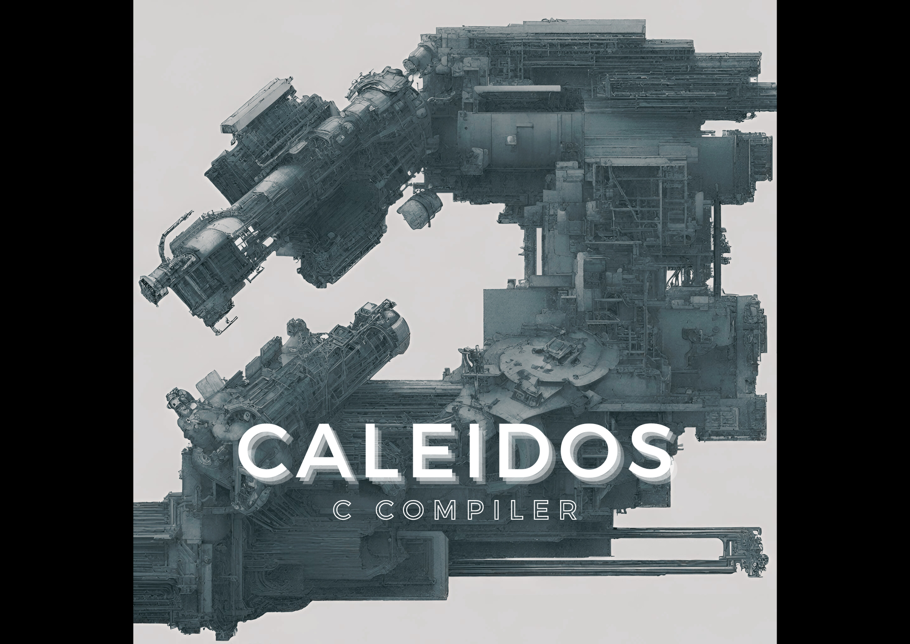

# Caleidos_C_Compiler

  

This repository is part of the EIE 2nd year Imperial College London Instruction Set Architecture and Compilers coursework. aiming to develop a compiler that translates C90 code into RISC-V assembly. The compiler is designed to parse C90 programs, construct an Abstract Syntax Tree (AST), and generate RISC-V assembly code, making C90 programs executable on RISC-V platforms.

|Contributors|CID|Email|
| ------ | ------ | ------ |
|Maximilian Adam| 02286647 | maximilian.adam22@imperial.ac.uk |
| Hanif Rais | | hanif.rais22@imperial.ac.uk |

## Overview

### Executing the compiler

### Documentation

In the `documentation` directory, you'll find detailed information about our project's specifications, development plans, and how we tracked our progress. This includes:

- [Weekly Meetings](./documentation/planning/): Abbreviated notes from our weekly team meetings where we discuss our progress, challenges, and next steps.
- [Timeline](./documentation/planning/Timeline.md): Our project timeline, outlining the milestones we set and their deadlines.
- [Test Pass Tracker](./documentation/planning/TestPassTracker.md): A tracker for our test cases, helping us monitor how well our compiler is performing and where improvements are needed.

### Include Directory

The `include` directory contains all the header files crucial to our compiler's operation. Some of the key files are:

- [ast_node.hpp](./include/ast/ast_node.hpp): Defines the structure of the AST, which is central to how our compiler understands and translates C90 code.
- [ast_context.hpp](./include/ast/ast_context.hpp): Manages the compiler's context, ensuring that the necessary information is carried through the various stages of compilation.
- [ast_primitives](./include/ast/primitives/ast_primitives.hpp): Contains the definitions for primitive data types and foundational AST nodes, essential for type checking and variable management.

### Source Code

Located in the `src` directory, the core of our compiler's source code includes:

- [parser](./src/parser.y) (YACC): Takes C90 source code and builds an AST, laying the groundwork for the compilation process.
- [lexer](./src/lexer.flex) (Flex): Tokenizes the C90 code, making it easier to parse and understand.
- [compiler.cpp](./src/compiler.cpp): Orchestrates the entire compilation process, from parsing C90 code to generating RISC-V assembly.

### Testing

Our `testing` directory is devoted to ensuring our compiler works correctly and efficiently. It includes:

- [compiler_tests](./testing/compiler_tests): A suite of tests, including both provided and custom cases, aimed at rigorously testing our compiler's functionality and compliance with the C90 standard.
- [Debugging Guidelines](./testing/compiler_tests): Offers insights and methods for debugging the compiler, aiding in troubleshooting and refining the compiler's performance.

As we conclude this project, we're happy to present a compiler that meets the technical and academic goals we set out to achieve. This project has been fun but very demanding, a testament to the dedication, teamwork, and the  learning we have achieved along the way.
